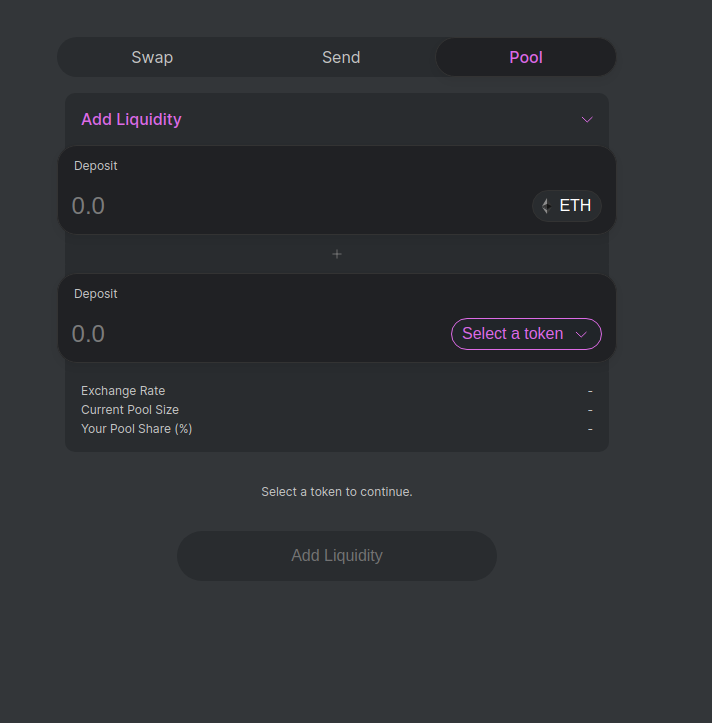
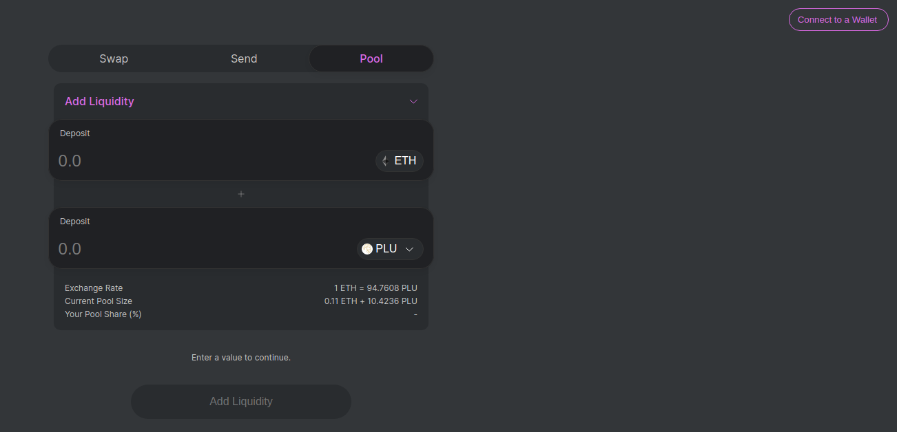
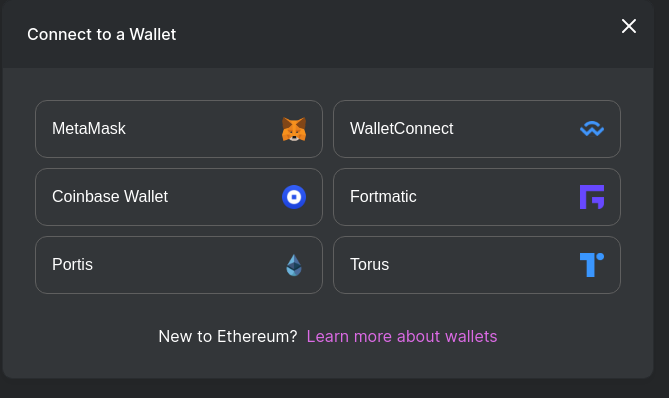
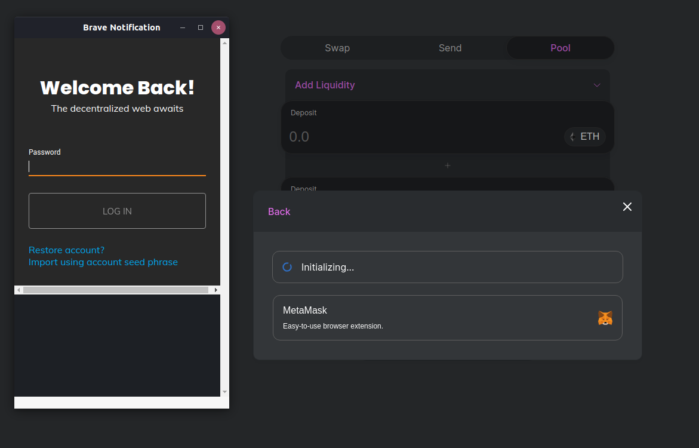
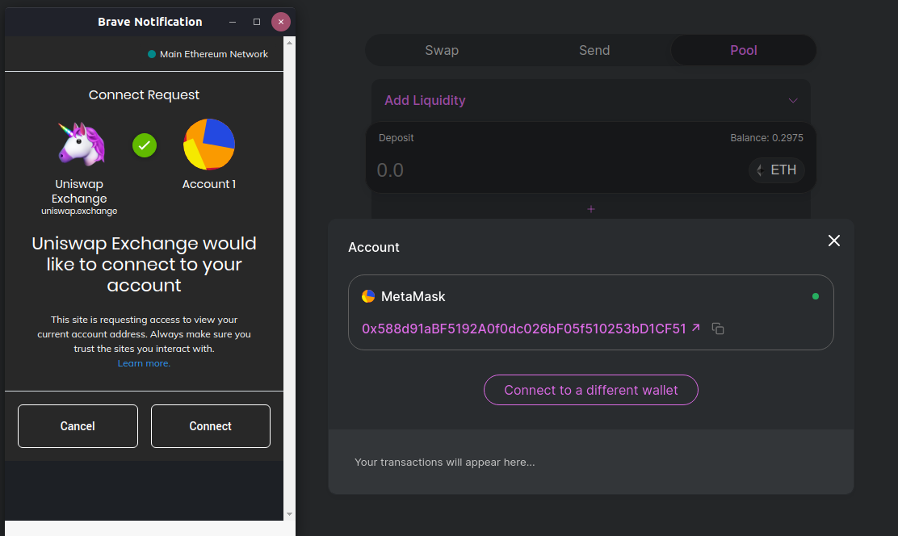
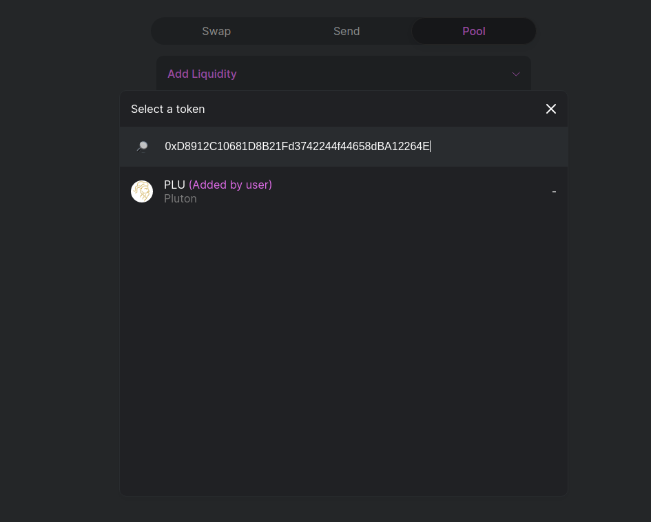
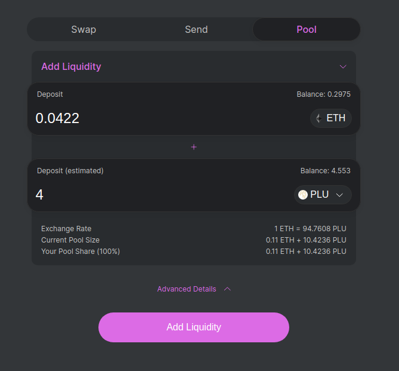

# Providing Liquidity on Uniswap

As the Coronavirus ravages the global economy,unemployment in the States is at all time highs, dwarfing the figures from the Great Recession. It is becoming blindingly apparent that the central banks of the world are intending to print their way out of the inpending crises.


Therefore, it becomes increasingly important for the indivdual to control their own financal future. Unlike at anypoint in history, we are so interconnected that the whole world will feel the impact of the decisions made by the largest economies in the world.

The silver lining in this world of ever more devalued money is that for the first time in history, we the individuals have the tools within our grasp to refuse to allow the governments to set their own financial interests above our own.

Decentralised finance is the future of money. As the industry becomes ever more mature, the overlap between traditional and modern decentralized is begining to fade.

To this end, I have been actively seeking alternatives to the current system. Which brings me nicely to Plutus.it

A bridge between the world of fiat and the world of crypto, there is the potential for a whole new system to emerge where we are not reliant upon decisions made behind closed door by shadowy bankers and power brokers pulling secret strings behind the scenes.

Plutus provide a non-custodial solution to the issue of a how to bridge the gap between the real world and the virtual. 

As an avid supporter of the movement, I have been eager to help move the project forwards. I am firm believer that the Network effect of indivduals will drive exponential value to any undertaking.

To this end, today I am going to show you how you too can get involved in the financial revolution and help to provide liquidity to the project.

# The Concept

We will be using the protocol Uniswap. Uniswap is a protocol for exchanging ERC-20 tokens on Ethereum. It eliminates trusted intermediaries and unnecessary forms of rent extraction, allowing for fast, efficient trading. Where it makes tradeoffs decentralization, censorship resistance, and security are prioritized. Uniswap is open-source software licensed under GPL.

Uniswap is made up of a series of smart contracts, each the venue for a unique ERC-20⇄ERC-20 pair. Pair smart contracts hold reserves (balances) of their constituent tokens, and define rules around how these reserves can be changed. Anyone can become a liquidity provider for a pair by depositing an equivalent value of each token in exchange for pool tokens. These tokens track liquidity providers’ pro-rata shares of the total reserves, and can be redeemed for the underlying assets at any time.

Pairs act as automated liquidity providers, standing ready to accept one token for the other as long as the “constant product” formula is preserved. This formula, most simply expressed as x * y = k, states that trades must not change the product (k) of a pair’s reserve balances (x and y). Because k remains unchanged from the reference frame of a trade, it is often referred to as the invariant. This formula has the desirable property that larger trades (relative to reserves) execute at exponentially worse rates than smaller ones.

In practice, Uniswap applies a 0.30% fee to trades, which is added to reserves. As a result, each trade actually increases k. This functions as a payout to liquidity providers, which is realized when they burn their pool tokens to withdraw their portion of total reserves. In the future, this fee may be reduced to 0.25%, with the remaining 0.05% withheld as a protocol-wide charge.

Because the relative price of the two pair assets can only be changed through trading, divergences between the Uniswap price and external prices create arbitrage opportunities. This mechanism ensures that Uniswap prices always trend toward the market-clearing price.

# How We can join a Liqudity Pool and recieve a portion of the transaction fee

Requirements

1. A Web3.0 browser (I personally use the Brave Browser) INSERT REF LINK

2. The MetaMask Plugin (INSERT LINK)

3. A small amount of Ethereum

4. A small amount of Plutus

# Step 1
First We navigate to the Uniswap Pool Page 
[Uniswap](https://uniswap.exchange/add-liquidity)

 

# Step 2 
Connect our Metamask plugin to the Uniswap.
 

(Click the top right Connect Wallet)

 

 

 

# Step 3
Now, we search for the PLU token by the its smart contract
```
0xD8912C10681D8B21Fd3742244f44658dBA12264E
```
 

# Step 3
Make sure that you have have selected the correct Contract by verifying the contract on Etherscan as suggested!

# Step 4
Select the amount of liquidity to provide to the pool
 

# Step 5
Add the liquidity

Sign the transaction

Check the transaction status and see it is pending.

We will need to submit 2 transactions.

One to provide our eth

And the second to provide our Plut tokens.

Once we have signed these transactions, we can confirm that our funds are now removed from our Wallet.

In the place of these funds, we will now see within our wallet that we hold a 

# Removing liquidity from the pool

